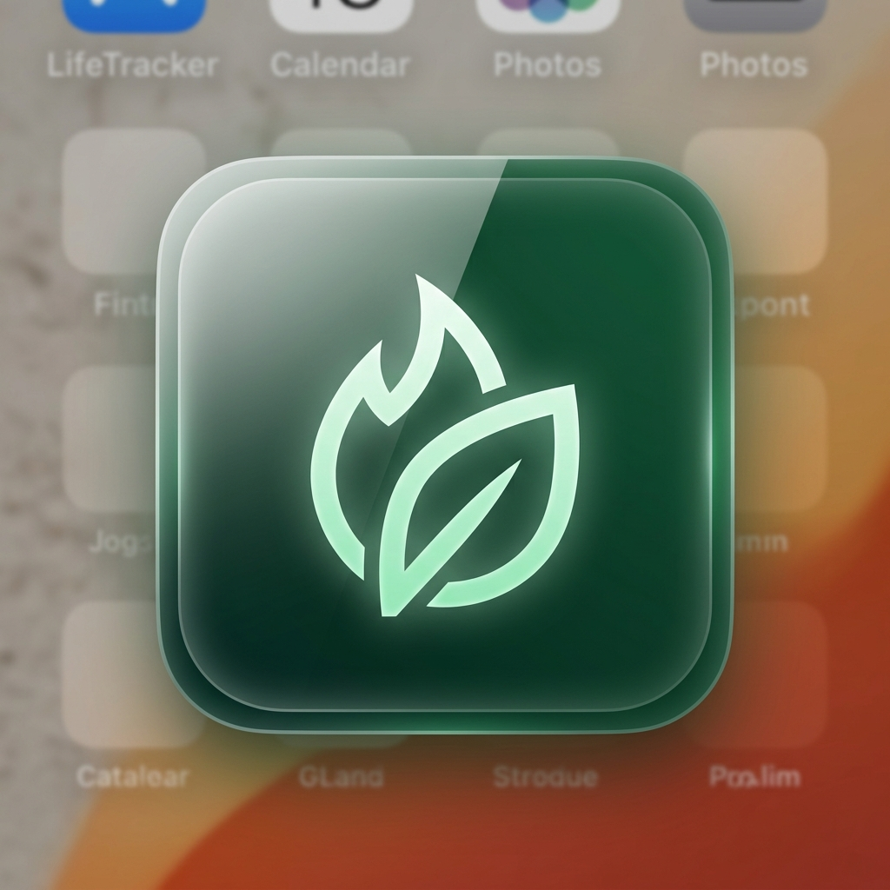
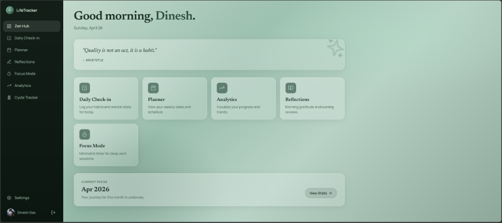
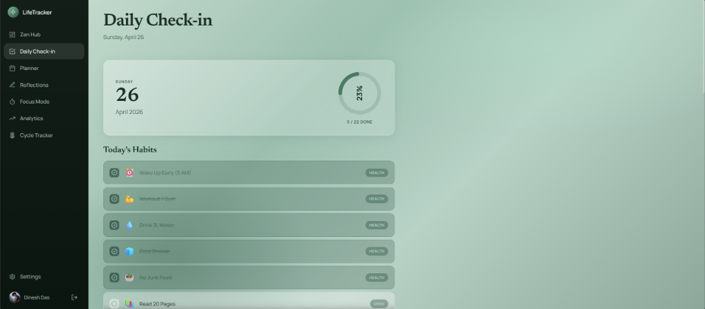
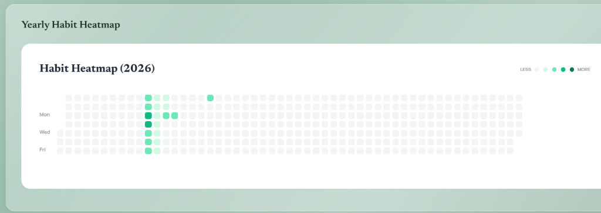

# 🌿 LifeTracker: Your Digital Sanctuary



> **"Quality is not an act, it is a habit."** — Aristotle

LifeTracker is a premium, glassmorphic personal management dashboard designed to turn your life into a game of consistency. Built with the **"Digital Sanctuary"** design philosophy, it provides a calming yet powerful environment to track your habits, plan your weeks, and visualize your personal growth — all while keeping your data strictly private in your own Google Sheet.

---

## ✨ Key Features

### 🏛️ Zen Hub
Your command center. Get a high-level overview of your day, quick access to all modules, and see your current progress at a glance.


### ✅ Daily Check-in
Log your habits and mental state with ease. The interactive progress ring shows you exactly how close you are to winning the day.


### 📊 Advanced Analytics & Heatmaps
Visualize your consistency over the entire year with a dynamic habit heatmap. Our custom logic calculates completion percentage (completed/total active habits) to give you a 100% accurate heat intensity map regardless of how many habits you track.


### 🧘 Focus Mode
A minimalist Pomodoro-style timer for deep work sessions. Completed sessions are logged to your sheet (FocusLogs tab) with daily and weekly focus-time stats, and an in-flight session survives navigation and refreshes.

### 📅 Weekly Planner
Map out your week, set priority goals, and ensure you're making time for what matters most.

### 📝 Reflections
A dedicated space for morning gratitude and evening reviews to maintain mental clarity and intentionality.

### 🌙 Dark Mode
A full dark theme driven by design tokens, toggleable from the sidebar (desktop) or the page header (mobile).

### 🎁 Year Wrapped & Data Export
A "Wrapped" recap of your year — best streak, best month, top habit — plus one-click JSON/CSV export of everything in your sheet.

### 📴 Offline-Ready PWA
Installable, with an offline-resilient sync queue that replays writes when your connection returns. Streaks support skip days that freeze (but don't break) your run.

---

## 🔒 Privacy First

LifeTracker is built on the principle of **Data Sovereignty**.
- **No External Databases:** We don't store your habits or journal entries on our servers.
- **Google Sheets Backend:** Your data lives exclusively in a spreadsheet named "LifeTracker Data" in **your own Google Drive**.
- **Transparent Access:** We only request access to the specific files created by the app.

---

## 🛠️ Tech Stack

- **Frontend:** React + Vite
- **Styling:** Tailwind CSS + custom glassmorphic design tokens (light & dark themes)
- **Database:** Google Sheets API (v4)
- **Auth:** Google Identity Services (OAuth 2.0)
- **Charts:** Recharts
- **Animations:** Framer Motion
- **Icons:** Lucide React

---

## 🚀 Getting Started

### Prerequisites
- Node.js (v18+)
- A Google Cloud Project with Google Sheets and Google Drive APIs enabled.

### Setup

1. **Clone the repository:**
   ```bash
   git clone https://github.com/your-username/life-tracker.git
   cd life-tracker
   ```

2. **Install dependencies:**
   ```bash
   npm install
   ```

3. **Configure Environment Variables:**
   Create a `.env` file in the root and add your Google Credentials:
   ```env
   VITE_GOOGLE_CLIENT_ID=your-client-id.apps.googleusercontent.com
   VITE_GOOGLE_API_KEY=your-api-key
   ```

4. **Run the development server:**
   ```bash
   npm run dev
   ```

---

## 🛠️ Project Configuration

### Google Cloud Setup
To use your own instance of LifeTracker, ensure your OAuth Client ID has the following:
- **Authorized JavaScript Origins:** Your deployment URL (e.g., `https://your-app.vercel.app`)
- **Authorized Redirect URIs:** Your deployment URL (e.g., `https://your-app.vercel.app/`)

### Scopes Required
- `.../auth/spreadsheets`: To read/write your tracking data.
- `.../auth/drive.file`: To create and manage the LifeTracker spreadsheet.
- `.../auth/userinfo.profile` & `email`: For personalized authentication.

---

## 🎨 Design System
The "Digital Sanctuary" aesthetic uses a curated palette of:
- **Primary:** Deep Forest Green (#1a3828)
- **Secondary:** Mint Green (#7db89a)
- **Accent:** Soft White (#f0f7f0)
- **Surface:** Glassmorphic translucent layers (backdrop-filter: blur(24px))

---

*Built with ❤️ for a more intentional life.*
